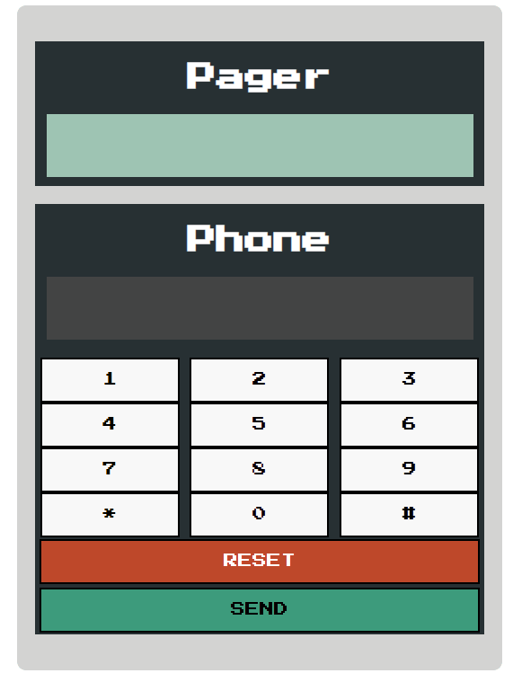

# Pager(Beeper)

I am probably too young to know what a "pager" is but this has been good practice learning JS and on CSS flexbox.
I also used the setTimeout() method and an audio to play when pager receives an incoming message.

**Link to project:** https://pager-beeper-brianbud.netlify.app/

## How's it made

**Tech used:** HTML, CSS, JavaScript
